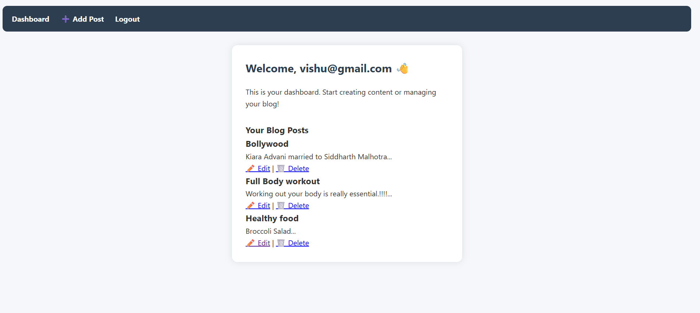

# 📝 DevBlog CMS – A PHP Blogging Platform

DevBlog CMS is a lightweight content management system built with PHP and MySQL that allows users to register, log in, and create, edit, or delete blog posts. It features a clean UI, secure login system, and an easy-to-use admin dashboard — perfect for learning full-stack PHP development.

---

## 🔧 Features

- ✅ User Registration & Login (with session handling)
- ✅ Secure Password Management
- ✅ Create / Edit / Delete Posts
- ✅ Admin Dashboard with Post Management
- ✅ Styled Frontend with Clean UI
- ✅ Built with pure PHP & MySQL (No Frameworks)

---

## 💻 Tech Stack

| Layer         | Technology      |
|---------------|------------------|
| Frontend      | HTML, CSS        |
| Backend       | PHP (Procedural) |
| Database      | MySQL            |
| Dev Server    | XAMPP (Apache + MySQL) |
| Version Control | Git + GitHub  |

---

## 📷 Screenshots

### 📌 Dashboard

---

## 🚀 Local Setup Instructions

### ✅ Prerequisites
- PHP installed (or XAMPP)
- MySQL running on port `3307` (XAMPP default)
- Git installed (for version control)
